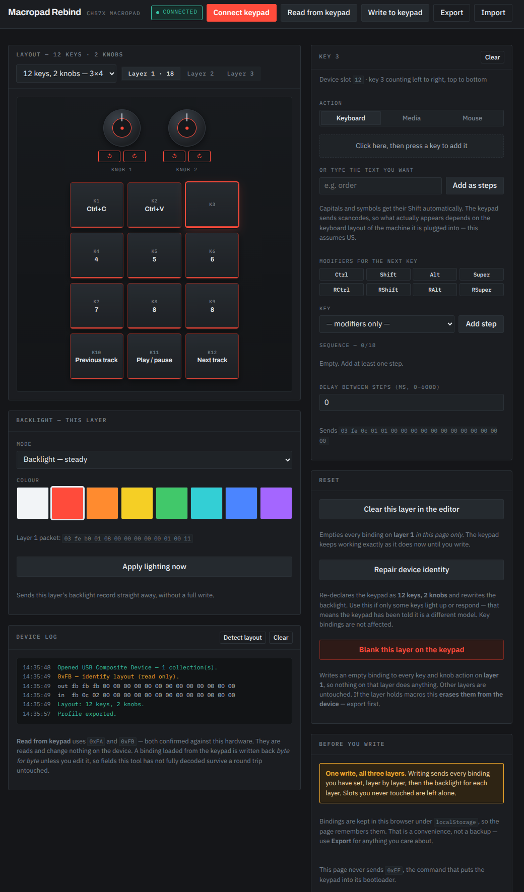
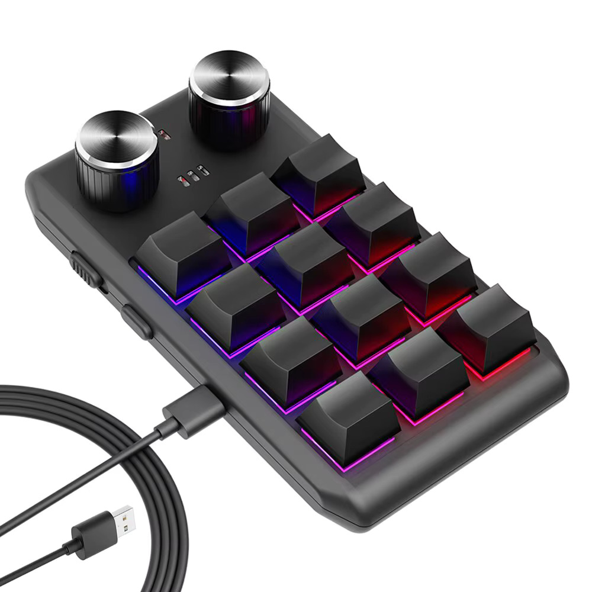

# Macropad Rebind

**Configure your cheap AliExpress macropad on Linux, macOS, Windows, ChromeOS
or Android — from a browser tab. Nothing to install, no drivers.**

### ▶ [Open it now — jvspier.github.io/macropad-rebind](https://jvspier.github.io/macropad-rebind/)

<p align="center">
  
</p>

Those little USB keypads with knobs — sold on AliExpress, Temu, Amazon and eBay
under a hundred different brand names — almost all use the same WCH CH57x chip,
and almost all ship with the same 32-bit Windows-only configuration tool. No
Linux build, no macOS build, and nothing at all if you are on a Chromebook.

Macropad Rebind replaces it. It is a single HTML file that talks to the keypad
over WebHID, so the same page configures your device from Linux, macOS, Windows,
ChromeOS or Android — no installer, no driver, no vendor software. It needs a
Chromium-based browser (Chrome, Edge, Brave, Opera, Vivaldi); Firefox and Safari
have not implemented WebHID.

It also **reads the configuration already on your keypad**, which the original
software's ecosystem could not do — so you can see what your keys are set to
before you change anything.

---

## Will it work with my keypad?



If your keypad came with software called `MINI_KEYBOARD`, `KEY_PRO`,
`Mini Keyboard`, or a generic unbranded `.exe`, it is almost certainly one of
these. They all look roughly like the one on the right — a small slab of keys
with one to three knurled knobs along the top.

**Check the USB ID.** The vendor must be `1189`:

| OS | How |
|---|---|
| Linux | `lsusb \| grep 1189` |
| macOS | System Information → USB |
| Windows | Device Manager → Properties → Details → Hardware Ids |

Supported: **`1189:8830`, `1189:8831`, `1189:8832`, `1189:8833`, `1189:8840`,
`1189:8842`, `1189:8850`**.

These are sold as: *3 key macro pad*, *6 key macropad with knob*, *9 key RGB
keypad*, *12 key macro keyboard with 2 knobs*, *15 key shortcut pad*, *mini
gaming keypad*, *one-handed keyboard*, *Photoshop shortcut pad*, *streaming
keypad*, *volume knob keypad*.

**All 17 layouts are supported:**

| Knobs | Key counts |
|---|---|
| none | 2, 4, 5, 6 |
| 1 | 3, 4, 6 |
| 2 | 6, 9, 12 |
| 3 | 4, 9, 11, 12, 15 |

The layout is read from the keypad itself. If the on-screen grid doesn't match
your hardware, pick the right model from the dropdown.

<br clear="all">

---

## Quick start

### 1. Open it

It must be served over `http://localhost` or `https://` — browsers only
allow USB access from a secure origin.

**The quickest route is [the hosted copy](https://jvspier.github.io/macropad-rebind/)** —
it is served over HTTPS, which is all the browser needs. Nothing is uploaded
anywhere; the page talks straight to the USB device.

To run it yourself instead, download or clone this repo, then in that folder run:

```bash
python3 -m http.server 8000
```

and open <http://localhost:8000/>. Python 3 is already installed on Linux and
macOS. On Windows use `py -m http.server 8000`, or `npx serve` if you have Node.

Or put `index.html` on any static host — GitHub Pages, Netlify, your own server.
There is no backend.

> **Browser support:** Chrome, Edge, Brave, Opera, Vivaldi, Arc — anything
> Chromium-based, on any OS including Android. **Firefox and Safari will not
> work**: they have not implemented WebHID and there is no workaround.

### 2. Linux only: allow access to the device

`/dev/hidraw*` is root-only by default, and your browser is not root. Install
the rule once:

```bash
sudo cp linux/60-ch57x-keypad.rules /etc/udev/rules.d/
sudo udevadm control --reload-rules
```

Then **unplug and replug the keypad**. To confirm:

```bash
getfacl -p /dev/hidraw* 2>/dev/null | grep -B4 $USER
```

Windows, macOS, ChromeOS and Android need nothing — they grant HID access
through the browser's own permission prompt.

<details>
<summary>Why the rule is numbered 60 and not 99</summary>

It uses `TAG+="uaccess"`, which hands the device to whoever is logged in at the
local seat. That is much narrower than adding yourself to the `input` group,
which would let any program you run read *every* keyboard on the machine.

systemd's `70-uaccess.rules` is what acts on that tag, so a rule numbered above
70 sets it too late and is silently ignored — the device stays root-only and
nothing tells you why.
</details>

### 3. Connect and configure

1. Click **Connect keypad** and pick your device from the browser prompt. Only
   the configuration interface is offered; the keyboard part of the device is
   deliberately invisible to the browser.
2. Click **Read from keypad** to pull in what is currently programmed.
3. Click a key or knob action, and bind it.
4. Click **Write to keypad**.

Your bindings live in the keypad's own flash. Nothing runs in the background —
once written, the keypad works on any computer with no software at all.

---

## What you can bind

**Keyboard** — any key, with any combination of Ctrl / Shift / Alt / Super, left
or right. Two ways to enter it:

- Click the capture box and **press the shortcut you want**. It is read from
  your real keyboard and converted.
- Or type a string into **Or type the text you want** and it becomes a macro,
  with Shift applied to capitals and symbols automatically.

Up to 18 steps per key, with an optional delay between them.

**Media** — volume, mute, play/pause, next, previous, stop, brightness,
calculator, lock screen, browser navigation.

**Mouse** — left/right/middle click, wheel up/down, pointer movement, drag.

**Knobs** — each knob has three independent bindings: turn left, press, turn
right.

**Layers** — three complete sets of bindings.

**Backlight** — off, steady, shock, shock2, or light-up-on-press, in red,
orange, yellow, green, cyan, blue, purple or white, set per layer.

---

## Things worth knowing

**It shows you the diff before writing.** It reads the device first and
lists exactly what will change on which key, so a write is never a leap of faith.

**Untouched bindings are preserved byte for byte.** Anything read off the keypad
and not edited is written back exactly as it came, so parts of the format this
tool doesn't fully decode survive a round trip.

**Export your config.** Bindings persist in the browser's `localStorage`, which
is a convenience, not a backup. **Export** writes a JSON file you can keep or
re-import.

> ⚠️ **Exported profiles contain whatever your macros type.** If a key types a
> password, it is in that file in plain text. The same is true of the keypad
> itself — anything that can open the device can read your macros back.

**If only some keys work or light up**, the keypad has been told it is a
different model. Press **Repair device identity**. Your bindings are unaffected.
[docs/PROTOCOL.md](docs/PROTOCOL.md) explains the cause.

---

## Command line

`linux/probe.py` prints the keypad's current configuration. Python 3, no
dependencies:

```bash
python3 linux/probe.py
```

## Tests

```bash
node test-protocol.mjs
```

159 assertions, no dependencies. The test pulls the message builder out of
`index.html` itself, so it always checks the file that actually ships.

## Protocol

[docs/PROTOCOL.md](docs/PROTOCOL.md) documents the full wire format: the two HID
interfaces, the 64-byte record layout, key and knob slot numbering, the physical
grid mapping, the lighting byte, and one undocumented command that will make a
working keypad look broken if you send it blind.

## Credits

Write-side byte layout cross-checked against
[kriomant/ch57x-keyboard-tool](https://github.com/kriomant/ch57x-keyboard-tool)
(MIT, © 2023 Mikhail Trishchenkov), whose unit tests carry vectors verified
against real USB captures — this project's tests assert against them. If you
would rather have a command-line tool driven by a YAML file, use that one.

## Licence

MIT — see [LICENSE](LICENSE).

The product photograph in `images/` is the manufacturer's and is not covered by
that licence.

---

<sub>Keywords: macropad, macro pad, macro keyboard, mini keyboard, mini keypad,
shortcut keypad, hotkey pad, one-handed keyboard, programmable keypad, custom
keypad, volume knob, rotary encoder, CH57x, WCH, 1189:8842, 1189:8840,
1189:8850, MINI_KEYBOARD, KEY_PRO, AliExpress keypad, Temu macropad, WebHID,
hidraw, udev, Linux macropad software, macOS macropad software, Linux
alternative to Windows keypad software, remap keypad Linux, configure macropad
without Windows.</sub>
